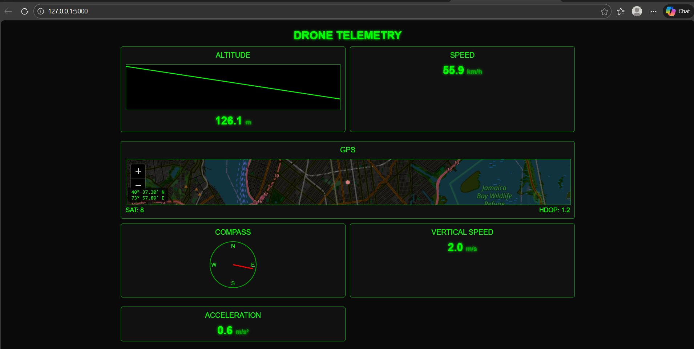

# Drone Telemetry Simulator

A terminal-based drone telemetry simulator that displays real-time drone metrics including altitude, speed, battery percentage, and GPS coordinates. The simulation runs for 30 seconds with values updating every second.

## Features

- Real-time telemetry display with gauges
- Simulated altitude, speed, battery, and GPS data
- Compass heading indicator
- Status monitoring
- Responsive terminal UI using Python's curses library

## Requirements

- Python 3.6 or higher
- Windows, macOS, or Linux
- Terminal with support for ANSI escape codes

## Installation

1. Clone this repository or download the files
2. No additional dependencies are required (uses only Python standard library)

## Usage

Run the simulation with Python:

```bash
python drone_telemetry.py
```

### Controls

- The simulation runs automatically for 30 seconds
- Press `q` to quit the simulation at any time

## Output

The program displays the following information:
- Current simulation time
- Altitude gauge (in meters)
- Speed gauge (in km/h)
- Battery level gauge (in percentage)
- GPS coordinates (latitude and longitude)
- Compass heading
- System status

## Screenshot



## License

This project is open source and available under the MIT License.
